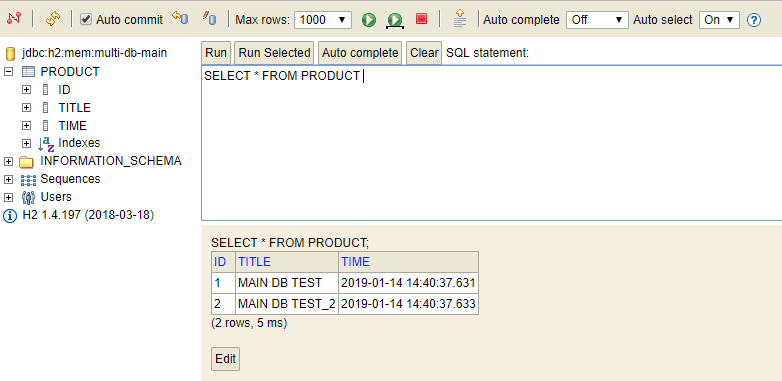
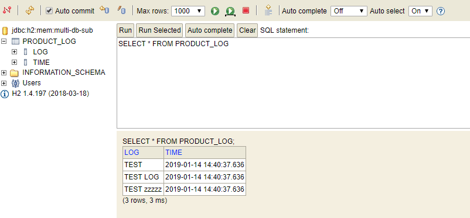

# Spring Boot Mybatis 
> Spring Boot + Mybatis + Aop를 활용한 Transaction 설정

## 프로젝트 설명
#### Multi Database 설정
###### JAVA 설정파일
- package 내 kr.geun.o.hwp.mybatis.config 하위 클래스 참고
    - AbstractMybatisConfig
        - 설정 파일 내 공통 설정 클래스
        - MainDbMybatisConfig
            - Main Database 설정 관련 클래스
        - SubDbMybatisConfig
            - Sub Database 설정 관련 클래스
        
    - InitSqlData
        - Spring Boot 가 init 되었을 때 초기화할 쿼리
        - classpath 하위 initQuery 폴더에 넣어서 사용하도록 되어있음.
        
###### Annotation 
- DAO 내에 @MainDB, @SubDB 를 선언하여 타겟 DB를 지정함.

###### XML 설정
- namespace 를 지정한 DAO Class 명을 패키지 까지 포함해서 작성한다.
- 원하는 쿼리를 넣으면 됨.

###### AOP 내 설정
- Service로직 구현체 클래스명이 Impl로 끝날경우, add, modify, delete 등으로 메소드가 실행될 경우 transaction이 동작하도록 설정함.

## 결과창
#### H2 Console
> localhost:8080/console 에 접근하여 확인
###### MAIN

###### SUB

